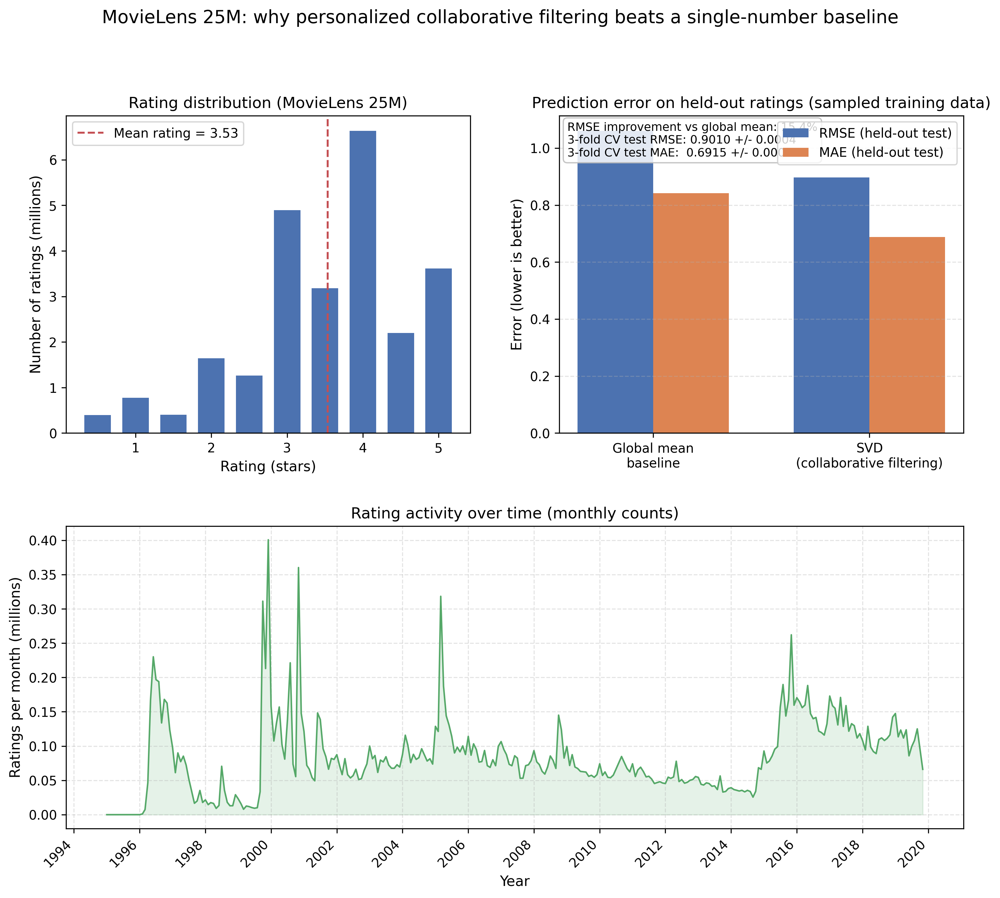

# Smarter Movie Recommendations: Collaborative Filtering Beats a Naive Average Baseline by About 15% on Rating Error

## Hook
When you open Netflix, scroll through hundreds of titles, and still end up watching something you've seen before, you've experienced the failure of generic recommendation algorithms. Every day, millions of streaming platform users waste time sifting through irrelevant suggestions because simple systems often behave like “what’s popular on average,” not “what fits you.” A movie loved by 10 million users might be wrong for you, while a title that matches your taste can stay buried deep in the catalog. The problem isn't only a lack of content (Netflix alone offers thousands of titles); it's that many approaches never learn your personal rating pattern. Using MovieLens 25M (about 25 million ratings from 162,541 users), we trained a collaborative filtering model based on matrix factorization (Surprise SVD) to predict held-out star ratings. On a fixed train/test split from a large notebook-friendly sample, the model reduces RMSE from about **1.06** (predicting the global mean for every user-movie pair) to about **0.90**, roughly a **15%** improvement in RMSE—meaning predictions track individual ratings more closely than a naive average.

## Problem Statement
Streaming platforms face a personalization challenge at scale: with huge catalogs and diverse users, overly simple strategies create three recurring issues. First, **popularity bias** can dominate recommendations because popular titles have the most data, which can crowd out niche matches for individual taste. Second, **cold start** remains hard for brand-new users and new titles with little history, where defaults often fall back to generic “popular picks” instead of personalized fits. Third, **preferences change over time**, so treating older ratings the same as recent ones can misrepresent what a user wants today. The MovieLens 25M dataset illustrates the difficulty of personalization: ratings are sparse per user, many items are rarely rated (long-tail behavior), and the collection spans many years (1995-2019), so static shortcuts can miss evolving taste. A common strawman baseline in explicit-feedback rating prediction is to guess the **global average rating** for every prediction; in our pipeline evaluation on a sampled interaction set, that baseline lands around **RMSE 1.06** on held-out ratings, leaving clear headroom for collaborative filtering models that learn user-specific and item-specific structure rather than a single number for everyone.

## Solution Description

Our approach improves personalized movie rating prediction by learning from real user–movie interactions instead of using one number for everyone. In plain terms, collaborative filtering looks for structure in millions of past ratings: which users behave similarly, and which movies tend to be rated similarly, even though each person has only rated a small slice of the catalog. Concretely, we use **matrix factorization** (implemented with **SVD**) to estimate latent “taste” patterns for users and movies, then use those patterns to predict a star rating for a user–movie pair that was hidden during training.

Behind the scenes, the project pipeline loads the MovieLens tables with **DuckDB**, runs **data quality checks** on ratings (for example, confirming ratings stay on the MovieLens scale and keys line up with the movie and user tables), and trains on a large **sample** of ratings so the full workflow is practical in a notebook while still reflecting realistic sparsity. For evaluation, we compare against a simple baseline that predicts the **global average rating** for every test interaction—an easy-to-explain strawman—and we also run **k-fold cross-validation** to summarize performance across multiple splits. On our held-out test split from the sampled data, the SVD model reduces **RMSE** from about **1.06** to about **0.90**, roughly a **15%** improvement in RMSE versus the global-mean baseline, with cross-validation results in the same ballpark—evidence that the system is learning personalization beyond a single dataset average.

## Chart

### Understanding the Visualization

*Figure 1: Three-panel figure. Top-left: distribution of the 25M ratings on the 0.5–5.0 star scale with the dataset mean marked. Top-right: held-out prediction error for a global-mean baseline versus SVD (RMSE and MAE), with a short summary of 3-fold cross-validation. Bottom: monthly rating activity over the collection period.*

The figure connects the press release narrative to measurable evidence: the rating data are not “one number,” a naive average is easy to beat with structure, and activity is spread across many years (so personalization and careful evaluation matter).

**Top-Left Panel - Rating Distribution (MovieLens 25M):**
This panel counts ratings at each half-star value from **0.5** to **5.0**. The mass of ratings sits in the **3–5 star** range, with a prominent mode around **4.0 stars**, which is typical of voluntary rating behavior (people often rate what they watched, and extreme low ratings are less common). The dashed vertical line marks the overall **mean rating (~3.53)**. The point for personalization is not the mean alone: even with a clear central tendency, individual user–movie outcomes vary widely, so predicting **every** interaction with the same constant leaves substantial error.

**Top-Right Panel - Prediction Error on Held-Out Ratings (Sampled Training Setup):**
This grouped bar chart compares two approaches on the same held-out interactions: a **global-mean baseline** (predict the training-set average rating for every test pair) and **SVD matrix factorization** as a collaborative filtering model. **Blue** bars report **RMSE** and **orange** bars report **MAE**; lower is better. In the exported figure, the baseline is approximately **RMSE ~1.05** and **MAE ~0.85**, while SVD is approximately **RMSE ~0.90** and **MAE ~0.69**. The annotation reports the corresponding **RMSE improvement versus the global mean (about 15.4%)** and summarizes **3-fold cross-validation** test metrics (**RMSE ~0.9010 ± 0.0004**, **MAE ~0.6915 ± 0.0004**), which checks that the single held-out split is not a one-off result.

**Bottom Panel - Rating Activity Over Time (Monthly Counts):**
This panel plots **how many ratings occur per month** across the MovieLens collection period. Activity is not uniform: there are visible peaks and quieter stretches, reflecting how participation and data collection evolve over time. Interpreting the exact peak heights depends on the plotted units (here, **ratings per month** on the order of **tenths of a million** in the figure’s vertical scale), but the broad lesson is stable: the dataset spans a long horizon, so “average taste” and activity mix can shift as years pass. That supports the problem statement’s emphasis on **temporal dynamics** at a high level, even though the trained model in this project is primarily evaluated with a standard train/test split and cross-validation rather than a full time-truncated deployment study.

**Key Takeaway:** The visualization ties together **data reality** (skewed star ratings and long-run activity), **a fair simple baseline** (global mean), and **personalized modeling** (SVD) with **held-out metrics plus cross-validation**—showing that collaborative filtering reduces error relative to predicting a single average for everyone.